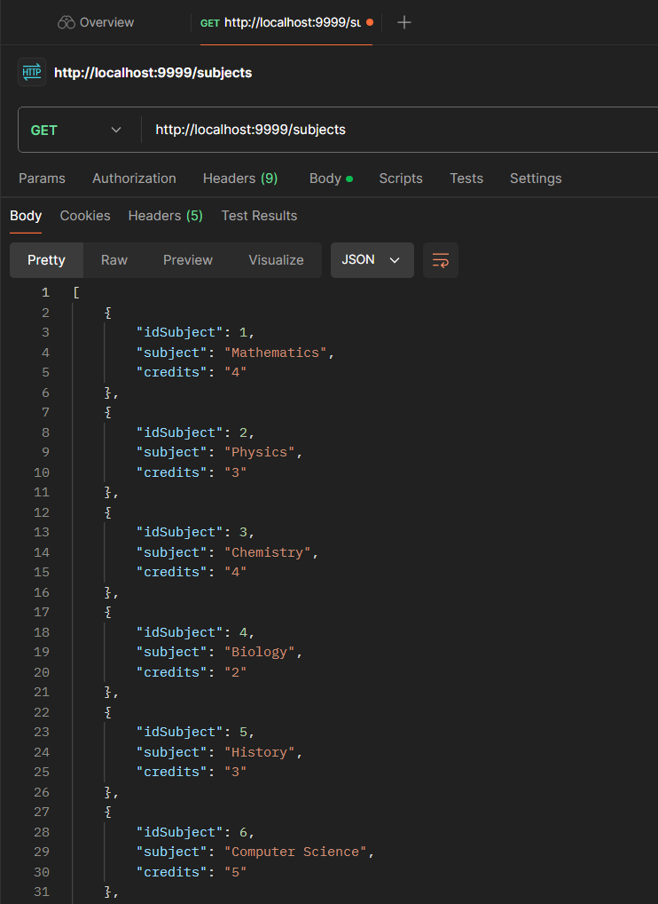
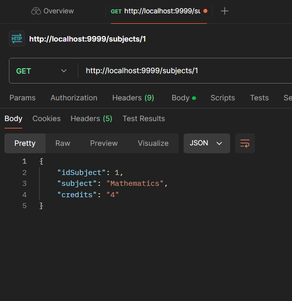
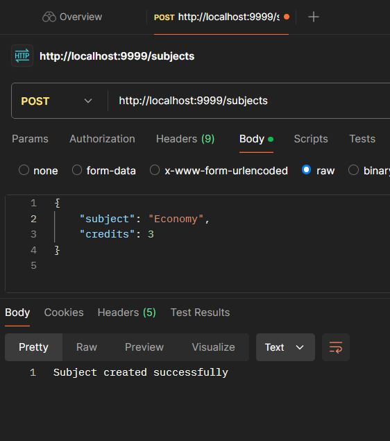
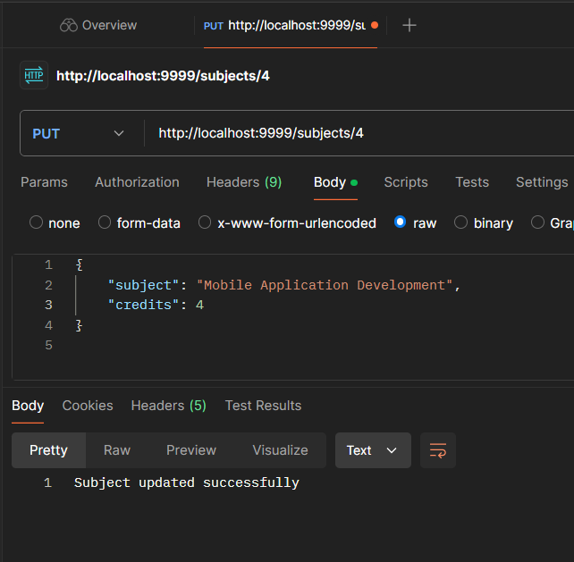
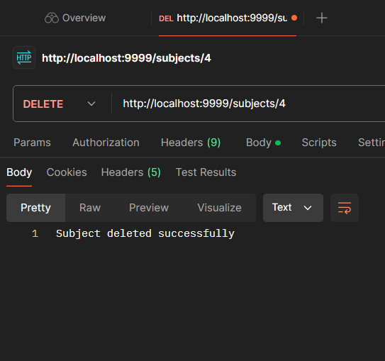

# Examen del T1 Lenguaje de Programación II

## Descripción
Este proyecto es un examen de Lenguaje de Programación II que implementa un mantenedor básico (CRUD) para gestionar asignaturas. El sistema permite realizar operaciones de creación, lectura, actualización y eliminación de asignaturas en una base de datos.

## Estructura del Proyecto

### Carpetas

- **entity**:
    - Carpeta donde se almacenan las **entidades** del proyecto. Cada entidad representa una tabla en la base de datos y define la estructura de los datos que se manejarán.

- **repository**:
    - Esta carpeta contiene las **interfaces de los repositorios** y sus implementaciones. Los repositorios son responsables de la interacción con la base de datos, manejando operaciones CRUD y consultas específicas sobre las entidades.

- **service**:
    - En esta carpeta se encuentran las **clases de servicio** que contienen la lógica de negocio del proyecto. Los servicios se encargan de procesar los datos provenientes de los repositorios y ejecutar las reglas de negocio.

- **controller**:
    - Esta carpeta contiene los **controladores** que manejan las solicitudes HTTP. Los controladores son responsables de recibir las peticiones del cliente, interactuar con los servicios y devolver las respuestas adecuadas.

## Métodos HTTP del SubjectController

### 1. `GET /subjects`
- **Descripción**: Recupera una lista de todas las asignaturas.
- **Respuesta**:
    - **200 OK**: Devuelve la lista de asignaturas en formato JSON.
    - **204 NO CONTENT**: Indica que no hay asignaturas disponibles.

### 2. `GET /subjects/{id}`
- **Descripción**: Recupera una asignatura específica por su ID.
- **Parámetros**:
    - `id`: ID de la asignatura a recuperar.
- **Respuesta**:
    - **200 OK**: Devuelve la asignatura encontrada en formato JSON.
    - **400 BAD REQUEST**: Si el ID es menor o igual a cero.
    - **404 NOT FOUND**: Si no se encuentra la asignatura con el ID proporcionado.
      

### 3. `POST /subjects`
- **Descripción**: Crea una nueva asignatura.
- **Cuerpo de la solicitud**:
    - Debe incluir un objeto JSON con los detalles de la asignatura, que incluye:
        - `nombre`: Nombre de la asignatura.
        - `creditos`: Créditos de la asignatura.
- **Respuesta**:
    - **201 CREATED**: Indica que la asignatura se creó correctamente.
    - **400 BAD REQUEST**: Si los datos de la asignatura son inválidos o faltan.
      
  
### 4. `PUT /subjects/{id}`
- **Descripción**: Actualiza una asignatura existente.
- **Parámetros**:
    - `id`: ID de la asignatura a actualizar.
- **Cuerpo de la solicitud**:
    - Debe incluir un objeto JSON con los nuevos detalles de la asignatura.
- **Respuesta**:
    - **200 OK**: Indica que la asignatura se actualizó correctamente.
    - **400 BAD REQUEST**: Si el ID es inválido o los datos son inválidos.
    - **404 NOT FOUND**: Si no se encuentra la asignatura con el ID proporcionado.
      
  
### 5. `DELETE /subjects/{id}`
- **Descripción**: Elimina una asignatura existente.
- **Parámetros**:
    - `id`: ID de la asignatura a eliminar.
- **Respuesta**:
    - **200 OK**: Indica que la asignatura se eliminó correctamente.
    - **400 BAD REQUEST**: Si el ID es inválido.
    - **404 NOT FOUND**: Si no se encuentra la asignatura con el ID proporcionado.
      

## Experiencia
- La experiencia de la realización de este examen fue totalmente gratificante, como mencioné en el Blackboard tuve algunos problemas con el GitHub, pero nada que no se pueda solucionar, gracias por el examen tan sencillo.
